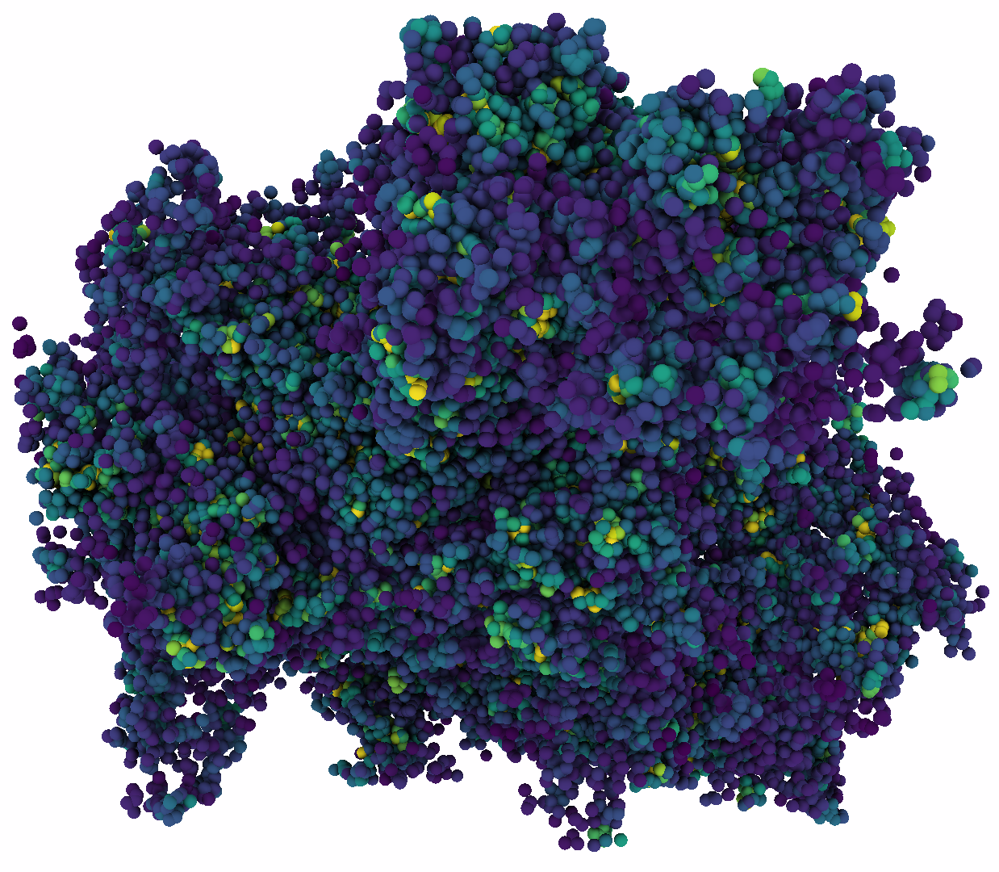

# cool_random
Tribute to the "cool_random" small particle data set.

_cool_random visualized in [MegaMol™](https://megamol.org)_

## Files

### `cool_random.mmpld`
The is the original [mmpld](https://github.com/UniStuttgart-VISUS/megamol/tree/master/docs/mmpld) file of the cool_random data set.

It is a single time frame, with one list of particles, with `73642` particles.

Most particles store as color `R: 64, G: 64, B: 255`.

All particles stor as radius `0.5`.

### `cool_random.raw`
The is a raw memory dump of `cool_random.mmpld` for easier consumption without the need for additional tools.

This file is exactly `73642 x 3` 32-bit float values (883,704 Bytes), the `(x, y, z)` coordinates of all particles in cool_random (stored interleaved: `xyzxyzxyz...`).

The file is generated by the tool [makeRaw](./makeRaw) in this repository.

## Story
Sometimes an accident or a mistake leads to something unexpected.
This here happened while [I](https://www.sgrottel.de) was starting at the [Visualization Research Center of the University of Stuttgart (VISUS)](https://www.visus.uni-stuttgart.de) to work on my Ph.D. research.
I was changing [a program](https://www.vis.uni-stuttgart.de/publikationen/#publ_e089d0686007748bb16e887b0292af2e112217790_bibtex) which encodes the positions of particle-based data in an hierarchical kd-tree.
I started with a simple box, filled randomly with particles, taking some care they don't overlap too much.
Then I built the kd-tree.
And there was a bug.
Somehow the particles' coordinates where wrongly transformed from their global position to their relative positions within the hierarchy, and wrongly converted back to global positions again.
I don't know exactly what I did wrong.

The result was visually interesting, yes, I dare to say, nice.
So, I kept the data set around, and I actually used it as a small initial test data set for many, almost all of my methods and algorithms I created during my Ph.D. work.
I believe, it's structure is interesting and images of the data are visually pleasing.
I can say, this nicely randomized particle data set was a great companion for me during these times.

Thank you, cool_random. Thank you.

## License
The data set and all tools in this repository are freely available via the [MIT LICENSE](./LICENSE).

If you use the data set, I kindly ask that you link back to this repository: https://github.com/sgrottel/cool_random

If you do something cool, and want to share an image or a story, you are more than welcome to open a pull request.
